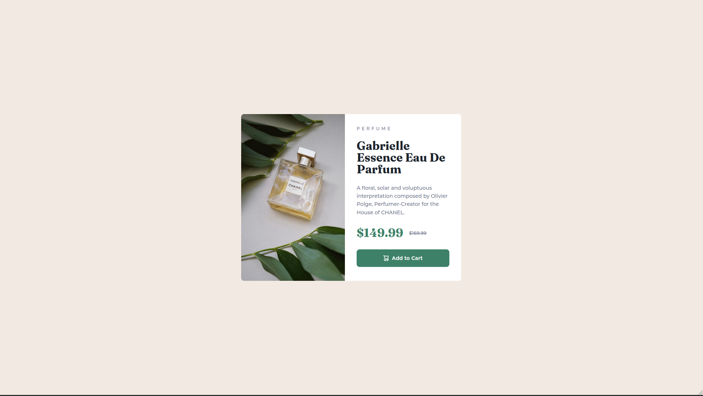

# Frontend Mentor - Product preview card component solution

This is a solution to the [Product preview card component challenge on Frontend Mentor](https://www.frontendmentor.io/challenges/product-preview-card-component-GO7UmttRfa). Frontend Mentor challenges help you improve your coding skills by building realistic projects. 

## Table of contents

- [Overview](#overview)
  - [The challenge](#the-challenge)
  - [Screenshot](#screenshot)
  - [Links](#links)
- [My process](#my-process)
  - [Built with](#built-with)
  - [What I learned](#what-i-learned)
  - [Continued development](#continued-development)
  - [Useful resources](#useful-resources)
  - [AI Collaboration](#ai-collaboration)
- [Author](#author)
- [Acknowledgments](#acknowledgments)

## Overview

### The challenge

Users should be able to:

- View the optimal layout depending on their device's screen size
- See hover and focus states for interactive elements

### Screenshot

Mobile

Tablet

Desktop

### Links

- Solution URL: [https://github.com/DevAmaruk/Product-Preview-Card](https://github.com/DevAmaruk/Product-Preview-Card)
- Live Site URL: [https://devamaruk.github.io/Product-Preview-Card/](https://devamaruk.github.io/Product-Preview-Card/)

## My process

### Built with

- Semantic HTML5 markup
- CSS custom properties
- Flexbox
- CSS Grid
- Mobile-first workflow
- Media Queries

### What I learned

- I learned how to use the "picture" tag to change the product image based on the screen width.
- I learned how to use the media queries to change the layout based on the screen width

### Useful resources

- [Coder Coder - How to make your website responsive](https://www.youtube.com/watch?v=vQDgoQKfdzM&t) - This helped me with the picture tag.
- [Css-Tricks - Flexbox Guide](https://css-tricks.com/snippets/css/a-guide-to-flexbox/) - This helped me with the Flexbox settings
- [Css-Tricks - Grid Guide](https://css-tricks.com/complete-guide-css-grid-layout/) - This helped me with the Grid settings

## Author

- Github - [Devamaruk](https://github.com/DevAmaruk)
- Frontend Mentor - [@DevAmaruk](https://www.frontendmentor.io/profile/DevAmaruk)
- Linkedin - [Jonathan Guthauser](https://www.linkedin.com/in/jguthauser/)

